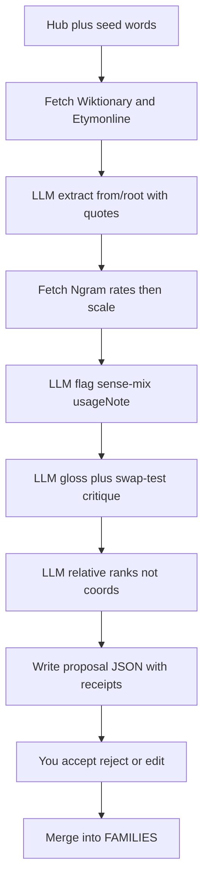

# AI to make the word dataset trustworthy

The dataset is 6 families / 37 words, all inline in [`nuance-cube-v0.1.html`](nuance-cube-v0.1.html) (`FAMILIES`, ~L345). The prototype rule still holds: **a wrong position costs more than a missing family.** You do not need to be a lexicographer. The pipeline should bring receipts (quoted dictionary lines, ngram series) so review is “does this match the source?” not “go look it up from scratch.”

LangGraph is the right framework *if* we treat it as a **review factory**, not an auto-thesaurus. Skip LangChain LCEL chains. Skip WordNet/VAD auto-placement. Skip live APIs inside the cube (CORS, drift, footer honesty).

## What each field is allowed to be

| Field | AI role | Human must decide | Why |
|---|---|---|---|
| `x,y,z`, `band` | Propose **family-relative ranks** (“svelte is the most complimentary thin-word”) plus a *suggested* number | Final coords and lesson axis (`answer`) | Models are bad at calibrated −1…1; walk already broke when intensity was confused with speed ([fix_walk_family](.cursor/plans/fix_walk_family_c5c08bba.plan.md)) |
| `gloss` | Draft 2–3 contrastive candidates | Pick / rewrite after **swap test** | High leverage; you can judge “would this still work if swapped?” without OED |
| `ex` | Draft sentences in the *intended* sense | Reject if it uses the wrong sense (`bright` = light) | Easy for models, easy for you |
| `from`, `root` | **Extract** from fetched Wiktionary/Etymonline text | Accept trail only if every `lang`/`form`/`year` is in the quote | Ungrounded LLMs invent Latin and dates |
| `usage` (6 floats) | **Do not generate.** Fetch Google Books Ngram rates, then scale to own peak in code | Spot-check shape vs caption | Invented curves are worse than coarse samples |
| `usageNote` | Flag homographs / dominant other sense; draft the sentence | Keep/kill | Same trap as livid/kid/rank — already 7 notes |
| Family membership, `prompt`, `insight` | Suggest siblings and copy | Admit a word only if it teaches the axis | Search miss is honest; generated families were explicitly out of scope |

## Stack (small on purpose)

- **Python + Pydantic** matching the word schema (`w`, `x/y/z`, `band`, `gloss`, `ex`, `from`, `root`, `usage`, `usageNote`).
- **LangGraph** with tool nodes and `interrupt_before` on merge. That is the piece worth learning: branching when sources disagree, retry extract if a year is missing from the quote, stop for you.
- **Claude** (Sonnet) for gloss, swap-test, sense-mix, relative ranking. Cheap/fast model only for “pull fields from this page.”
- **Tools, not memory:** Wiktionary REST for etymology; Google Books Ngram JSON for the six years (smoothing ~3, English), scaled in Python; optional Etymonline page fetch. No embeddings as coordinates.
- **Outputs:** `data/families.json` as source of truth later; `proposals/<word>.json` with `evidence[]` quotes. The HTML stays the published lesson until you merge. Footer can stay “hand-placed / hand-sampled” because merge is still a human act.

Do **not** wire the cube to the graph. The app remains one file.

## First job: make the 37 awesome, then maybe grow

1. **Extract** `FAMILIES` to JSON (scripted, not by hand) so the graph has a real schema.
2. **Audit graph (existing words):** for each word, fetch sources, compare `from`/`root`/`usage`/`usageNote`/`gloss`, emit a diff. Concrete known gap: **no two words share `root.id`**, so root chips never jump in-app — a good, checkable win if cognates are real.
3. **Gloss pass:** model runs the swap test across the family and only proposes rewrites when two glosses are interchangeable.
4. **Sense-mix pass:** model lists other dominant senses; you keep notes only when the *curve* is polluted (same rule as [usage chart critiques](.cursor/plans/usage_chart_critiques_9f23d0ae.plan.md)).
5. **Only after the six families survive that review:** a “new family” graph that suggests members, never auto-adds. New coords start as ranks you place on the cube.

## What you review vs look up

You review **contrast and lesson fit** (swap test, “is march body-effort or cadence?”, “does this sibling belong?”). The graph is required to attach the dictionary snippet and the ngram six-tuple so you are not doing Etymonline homework. If evidence is missing, the node fails closed (omit `from`, do not fake a trail).

## What we will not build

- Auto-writing `x,y,z` into the HTML
- Live Wiktionary/Ngram in the prototype
- VAD/WordNet ingestion as placement
- A LangChain RAG over the whole language
