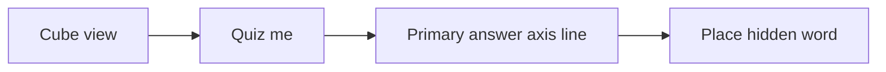

# Quiz me from the cube onto a line

All of this is in [`nuance-cube-v0.1.html`](nuance-cube-v0.1.html).

Today **Quiz me** only exists in **read** chrome ([`renderLessonChrome()`](nuance-cube-v0.1.html) ~L1515). The opening cube (**ask** phase) has no quiz CTA. [`startQuiz()`](nuance-cube-v0.1.html) only does `animate({flat:1})` if you are on the cube, so two-axis families flatten onto the **field** (`openFamily` sets `layout` to `'field'` when there are two answer axes).

The cube cannot host a 2D guess; quiz copy already talks about placing a word on the **line** or **field**.

## Button placement

In [`renderLessonChrome()`](nuance-cube-v0.1.html), put the same primary **Quiz me** (`#quizBtn`) on the **ask** view bar (after the camera presets), still hidden while `state.quiz` is set. Keep the existing read-mode button.

## Start from cube → default timeline

In [`startQuiz()`](nuance-cube-v0.1.html), if `state.flat < 0.5`:

1. If still in **ask**, flip `state.phase` to `'read'` so axis-pick / verdict stay out of the way (same as after Show me, without requiring a guess). Leave `state.sel` null so the detail panel stays empty during the placement.
2. Set `layout` to `'line'` and `lineAxis` to `orderedAnswer(f)[0]` — the family’s widest-spread answer axis (the usual “timeline ruler”). Do **not** default to the field.
3. Flatten with the same camera used in [`setRead`](nuance-cube-v0.1.html) for that axis (`formality` → `VIEWS.formality.cam`, otherwise `VIEWS.connotation.cam`), then `animate({flat:1})`. Skip the lift-through-cube step; you are already on the cube.

If you are already flat (line or field), keep today’s behavior: quiz on the current reading. **Another word** still calls `startQuiz` and must not reset the axis.

Quiz prompt, cue, overlay, and scoring stay as they are once the line is showing.
