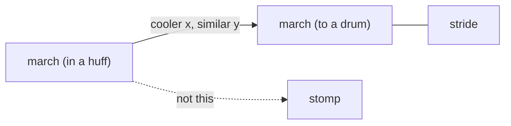

# Two marches on the cube

One gloss that says “cadence, not force” still leaves one point. The cube’s job is two positions. List them as **march (to a drum)** and **march (in a huff)**.

They are still the same gait (beat + destination). They are not two intensity poles. The huff is **connotation** (and a bit less formal). The heavy foot stays **stomp**.



Do not put the parenthetical inside `w`. Cube labels, quiz, home cards, gloss titles, and spark end-labels use a display name. Wiktionary, Etymonline, ngrams, search, and `cognatesOf` keep using `w: "march"`.

## Display

In [`nuance-cube-v0.1.html`](nuance-cube-v0.1.html):

```js
function wordLabel(w){
  return w.sense ? w.w + ' (' + w.sense + ')' : w.w;
}
```

Call it everywhere a human reads the word (`esc(w.w)` in stage labels, gloss grid, detail heading, quiz “Place this word”, home card lists, usage-spark end labels, `labelHalfW`). Leave `w.w` for `encodeURIComponent`, family search, hub match, cognates skip.

Optional `sense` on [`data/families.schema.json`](data/families.schema.json) Word. Same field in [`data/families.json`](data/families.json).

## Walk family data

Eight points. Prompt: “Eight ways of going on foot…” (lesson already scales with `words.length`).

- Existing march → `sense: 'to a drum'`, coords stay `0.05 / 0.40 / 0.45` (cadence, with stride).
- New point → `sense: 'in a huff'`, about `-0.35 / 0.50 / -0.05` (same beat, sour mood). Still below trudge `0.70` and stomp `0.90`.

Do not raise huff to stomp. If it sat at `y: 0.9` the lesson would again treat anger as effort.

- **Drum gloss / ex:** measured rhythm, column in even time (keep the current example).
- **Huff gloss / ex:** leaves stiffly, like a soldier off duty; *He marched off to his room and slammed the door* — slam is extra, the walk is still a beat.
- **Insight:** work runs amble → trudge / stomp. The two marches sit apart on mood, not on how hard the body works. Reading either as speed or as stomp puts them on the wrong end.

Shared `usage` / `usageMix` / `usageNote` on both (same spelling; month and military noun still swamp the gait). Spark will overlay two identical traces until one is selected; that is honest, not a second measurement.

Same `from` / `root` as today’s march.

## Out of scope

No sense-split of bright, livid, kid, etc. No change to the March-the-month mix flags. No ngram refetch.

## Verify

Walk lesson: both labels readable and not stacked; guess intensity; huff left of drum, not at the stomp pole; quiz shows the parenthetical; picking either still shows the mixed Google Books series and the month note.
