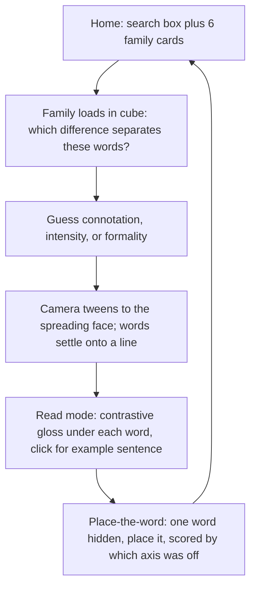

# Nuance Cube Prototype

## Core idea

One fixed semantic space instead of a bespoke axis per family:

- X: connotation, harsh to complimentary
- Y: intensity, mild to extreme
- Z: formality, casual to formal

Every family sits in the same cube. The lesson is discovering which axis actually separates a given family. The original timeline idea is the front face of that cube, so rotation teaches the axis and the flat face delivers the nuance.

## Deliverable

One file: `visuals_app/nuance-cube-v0.1.html`. No build step, no libraries, hand-rolled SVG projection. Same pattern as [why-lines-work-interactive.html](/Users/rebeccaclarke/Claude/Projects/Homeschooling/why-lines-work-interactive.html), which already hand-rolls an interactive SVG stage with `viewBox` plus `touch-action:none`.

## Lesson flow



The home screen is a lesson with a search box, not a thesaurus with a chart. A search miss says so honestly and offers the six real families rather than inventing a result.

The guess step allows more than one axis to be selected, because two families (smelly and smart) genuinely answer to two. For those, the reveal tweens to an angled view rather than a flat face, and says plainly that no single line can hold them.

## Data schema

Hand-placed coordinates, normalized to -1..1. No LLM generation in the prototype, since an unforgiveable wrong position costs more than a missing family.

```js
{
  hub: "thin",
  answer: "connotation",
  words: [
    { w: "emaciated", x: -0.95, y: 0.9, z: 0.5,
      gloss: "thin from starvation or illness - a medical alarm, never a compliment",
      ex: "Relief workers described the emaciated survivors." },
    { w: "skinny", x: -0.35, y: 0.4, z: -0.6,
      gloss: "thin in a blunt, slightly unkind way a friend might say out loud",
      ex: "He was a skinny kid who never filled out his jacket." },
    { w: "svelte", x: 0.9, y: 0.3, z: 0.4,
      gloss: "slender in an elegant, fashionable way - implies style, not just size",
      ex: "She looked svelte in the tailored coat." }
  ]
}
```

Gloss rule enforced during curation: if two glosses could be swapped and both still sound true, both are too weak and get rewritten.

## Six families

- thin: emaciated, scrawny, skinny, thin, slender, slim, svelte. Spreads on connotation.
- angry: annoyed, irritated, angry, furious, livid. Spreads on intensity.
- child: kid, child, minor, juvenile. Spreads on formality.
- smelly: musty, stinky, smelly, rank, reeking, fetid, putrid, malodorous, pungent. Spreads on formality and intensity at once, and the two do not track each other: malodorous is the most formal word yet the least visceral, while stinky is the most casual yet vividly physical. Pungent is the deliberate connotation outlier, since it can be a compliment about cheese or spice. This is the family that proves a single line was never enough.
- walk: amble, stroll, walk, stride, march. Spreads on intensity with a connotation tilt.
- smart: clever, bright, intelligent, brilliant, shrewd. Genuinely needs two axes, and is the test of whether the cube earns itself.

## Rendering approach

- Orthographic projection, not perspective, so distance never distorts a word's apparent position. Yaw and pitch rotation matrices, roughly 60 lines of JS.
- Floor grid at the base plus a vertical drop line from each word to the floor. This is what kills depth ambiguity.
- Depth-sorted draw order; far words dimmed and slightly desaturated.
- Snap-to-face buttons: connotation view, intensity view, formality view, free rotate. Camera tweens about 500ms with easing, which is the moment that sells the whole idea.
- Drag to rotate on desktop; on mobile, lock to snapped faces and swipe between them, since drag-rotate on a phone reads as noise.
- Confidence band drawn as a soft segment along the active axis where words genuinely overlap, such as skinny against scrawny.

## Visual direction

Dark ink field so the cube and words glow, keeping the Georgia and Helvetica pairing from the existing pages so it still feels like the same hand. Color ramp doubles the connotation axis (cool and harsh on the left, warm on the right), and type weight doubles intensity, so livid renders heavier than annoyed. Position teaches, color and weight confirm.

`prefers-reduced-motion` skips tweens and snaps instantly.

## Out of scope for v0.1

WordNet or VAD ingestion, whole-language search, accounts, and any generated families. Those only matter after the picture is proven trustworthy on six.