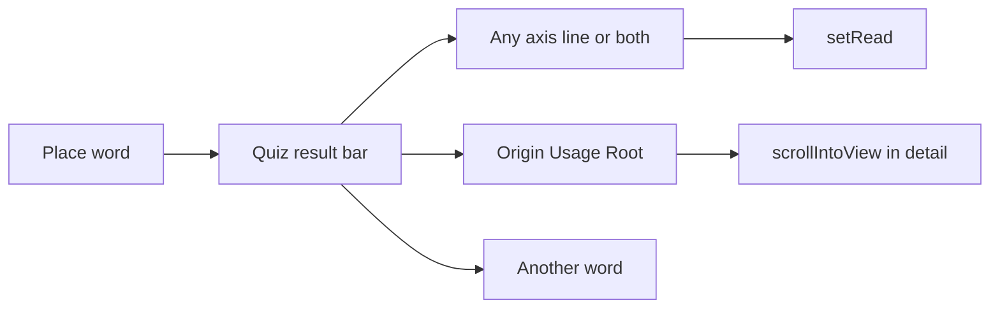

# Quiz buttons for other aspects

After you place a word, [`renderQuizBar()`](nuance-cube-v0.1.html) only offers **Another word** and **Stop quizzing**. The view bar already has “read as” for the *lesson* axes, and the detail panel stacks origin + usage + root (easy to miss under the enlarged chart). The new controls live in the quiz result bar.

## Result bar layout

When `q.done`, keep the score text, then two short rows (flex-wrap, existing `ghost` / `primary` buttons):

- **This word on:** one button per axis (`connotation`, `intensity`, `formality`) plus **both at once** when the family has two answer axes. Mark the current layout `.on`.
- **About it:** **Origin**, **Usage**, **Root** — only if that word has `from` / `usage` / `root`.
- Same row as today: **Another word** (primary) and **Stop quizzing**.

CSS: a `.quizActs` wrap under `.qres` (small label + gap), so it does not fight `.quizBar` padding.

## Map switches (all three axes)

Lesson chrome only offers the family’s `answer` axes. Quiz results should expose the *other* aspects too: `setRead('intensity')` already works for any axis (`layout='line'`, `lineAxis=which`). Wire the new buttons to the same `setRead`.

Guess overlay today stores SVG `px,py`. Switching layout would leave “your guess” in the wrong place. On answer, remember `q.placedLayout` and `q.placedAxis`. In [`quizOverlay()`](nuance-cube-v0.1.html), draw the gold ring / dashed gap **only when the current layout matches the one they clicked**. Score copy stays. Cube view: no 2D guess overlay.

While `state.quiz` is set, drop **Quiz me** from the view bar so the CTA is not duplicated.

## Panel jumps

In [`renderDetail()`](nuance-cube-v0.1.html), put stable ids on the three blocks (`detailOrigin`, `detailUsage`, `detailRoot`). Quiz buttons `scrollIntoView` those nodes (smooth unless reduced motion). Detail is already visible once the quiz is done (`quizzing` is `!done`).

No new data, no re-quiz-on-this-axis, no change to pre-placement quiz. **Another word** still picks a new random word on whatever layout you are currently reading.
