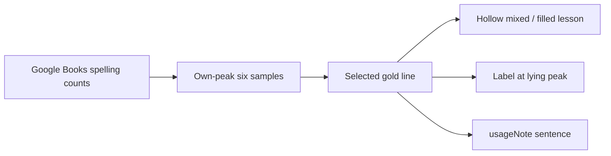

# Mark mixed senses on the usage chart

**Do not strip “unrelated results.”** Google Books has no sense tag. A line that pretended to be only anger-*livid* or mind-*bright* would be made up, which is worse than mixed counts plus honesty.

**Do put the meaning difference on the chart** — as a reading of the *same* six points, not a second measurement. Siblings stay faint solid traces. Only the selected gold series gets mix marks, plus the existing `usageNote` sentence.

That matches how these seven actually fail (not one pattern):

- **Time split:** livid, kid, rank, march — early samples are the other sense.
- **Whole career mixed:** bright, brilliant, minor — hollow all the way; the 1850/1950 peak is still the wrong sense.

A single dashed-from-year cutoff cannot cover both.

## Encoding (selected word only)

In [`usageSpark()`](nuance-cube-v0.1.html) (~L1222):

- Gold **path stays one polyline** (family overlay stays readable).
- Each of the six gold dots: **hollow** if that year is mixed, **filled** if it is mostly the lesson sense. No `usageMix` → all filled (today’s look).
- If any year is mixed, place a short label at the mixed sample with the **highest** value (the lying peak), e.g. `colour` at livid’s 1800. Same sans, muted, ~10px, above the dot so it does not hit the year ticks.
- When every sample is mixed (bright, brilliant, minor), dash the gold stroke (`stroke-dasharray`) so a line of hollow dots does not look like missing data.

Keep `.usageNote` under the caption. The chart mark is the *where*; the sentence is the *what*.



## Data (additive, curated)

On the seven words that already have `usageNote`, add:

```js
usageMix: [true, true, true, false, false, false],  // 1800 … 2019
usageMixTag: 'colour'
```

Proposed flags (confirm while editing against the existing notes, not new research):

- `livid` — mix 1800–1900; tag `colour` (1800 peak)
- `kid` — mix 1800–1850 (early goat); tag `goat`
- `minor` — mix all six; tag `lesser` (at 1950)
- `rank` — mix 1800–1900; tag `rank` or `order` (1800) — use `order` so the label is not the same as the word
- `march` — mix 1800–1900; tag `March`
- `bright` / `brilliant` — mix all six; tag `light` (1850 peak); dashed gold stroke

Schema comment at the `usage` field (~L350): `usageMix` marks sense-polluted samples of the **same** series; it is not a cleaned curve.

No ngram refetch. No `queue accept`. Coordinates unchanged.

## Out of scope

A second “true sense” line, grey-out of sibling curves, raw-frequency toggle, or subtracting a guessed fraction of light-*bright*.
