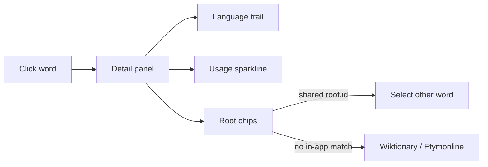

# Etymology in the detail panel

The cube’s job stays “what separates these synonyms.” History is a second lesson that appears only after you click a word in **read** mode. No live Wiktionary/Ngram fetch (CORS, drift, and it would contradict the footer: *nothing here is generated*). Thirty-five words is small enough to curate the same way glosses were curated.



## Where it lives

Only [`renderDetail()`](nuance-cube-v0.1.html) (around line 1261) and new CSS under `.detail`. Gloss cards, quiz, ask-phase cube, and home cards stay semantic. The stage is still connotation × intensity × formality; time is **not** a fourth axis (the existing “timeline ruler” is already the flattened semantic line).

## Word schema (additive)

Each entry in `FAMILIES[].words[]` gains three optional fields:

```js
from: [                          // oldest → English
  { lang: 'Latin', form: 'emaciare' },
  { lang: 'English', form: 'emaciated', year: 1620 }
],
root: {
  id: 'macer',                   // shared key across the 35 words
  form: 'macer',
  gloss: 'lean, meagre'
},
usage: [0.05, 0.12, 0.40, 0.88, 1, 0.72]  // 1800, 1850, 1900, 1950, 2000, 2019
```

- `usage` is **scaled to that word’s own peak** (0–1). Absolute Google Books counts would drown `svelte` under `thin`. Caption that honestly.
- `root.id` is how “links to the roots” work inside the file: same id → those words are cognate or share a morpheme. Most of the interesting story is that neighbors on the cube often **do not** share a root (`skinny` Germanic vs `svelte` Italian/French vs `emaciated` Latin).

Curation sources while filling the 35: OED / Etymonline / Wiktionary for `from`/`root`; Google Books Ngram (English, smoothing ~3) sampled at those six years for `usage`. Approximate is fine; the shape (loanword arriving late, slang peaking recently, legal term stable) is the point.

## Detail panel UI

Keep the existing title, gloss, example, coords. Under them:

1. **Language trail** — small uppercase chrome (same family as `.axName` / `.axPole`): `LATIN emaciare → ENGLISH 1620`. One line.
2. **Usage sparkline** — inline SVG (~46px tall, matching home-card sparklines). Selected word in gold; **sibling words in the same family as faint traces** so you see most/least against the set (e.g. `slender` vs `skinny` over two centuries). Poles labeled `1800` and `2019`.
3. **Root chips** — the `root.form` as a button. If any other word (any family) shares `root.id`, clicking it selects that word if it is in the current family, or shows a one-line “also in *thin*: emaciated” list with a jump when it is the same lesson. If nothing in-app shares it, the chip is a text link to `https://en.wiktionary.org/wiki/${encodeURIComponent(w.w)}` (and optionally Etymonline search). External links `target="_blank" rel="noopener"`.

Empty/`from` missing: omit that block; never show a fake trail.

## Small supporting bits

- CSS for `.detail .trail`, `.detail .spark`, `.detail .root` (sans, 11–12px, muted; chips use existing button tokens).
- Tiny `usageSpark(family, selIndex)` helper next to `sparkline()` (~line 1034).
- `select()` already refreshes detail; root jumps reuse it.
- Footer line: add that origins and usage curves are hand-sampled too.
- Do not match origin languages in home search unless it stays a one-liner in `familyMatches`.

## Out of scope

Live APIs, a chronological stage layout, PIE trees, audio, or expanding past the six families.
